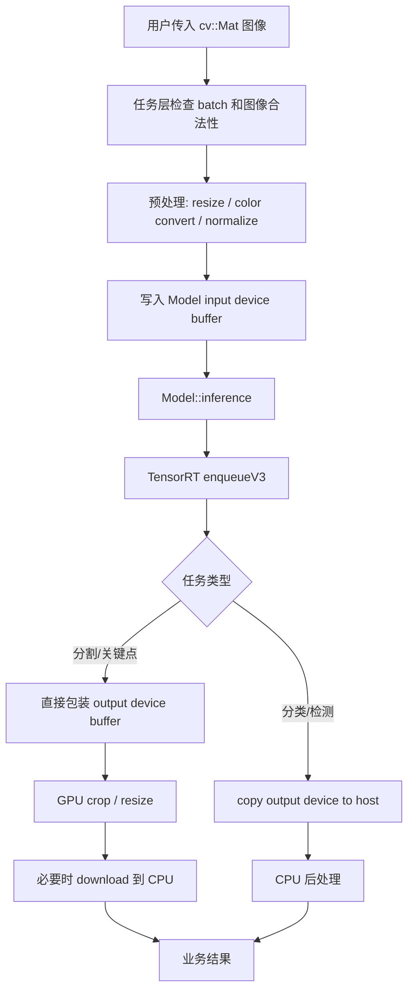
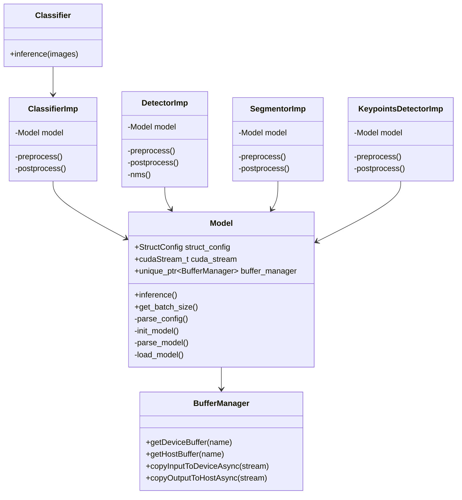

# 复现 WVAI-GPU SDK 库的路线与步骤

本文档给出从零复现一个类似 `wvai-gpu` 的 C++/CUDA/TensorRT 推理 SDK 的路线。目标不是逐字复制当前项目，而是理解其架构后，按阶段实现一个具备分类、检测、分割、关键点推理能力的可复用 SDK。

## 1. 复现目标

最终产物是一个 C++ SDK 动态库，例如：

```text
libmyai_gpu.so
```

它应该具备以下能力：

1. 使用 TensorRT 加载或构建模型；
2. 支持 `.onnx` 转 `.plan`；
3. 支持直接加载 `.plan`；
4. 支持 CUDA stream 推理；
5. 管理输入输出 GPU/CPU buffer；
6. 提供统一的业务接口；
7. 支持分类、检测、分割、关键点等任务；
8. 提供 example、test、benchmark；
9. 可选支持 FP16、INT8、模型加密。

## 2. 推荐复现顺序

不要一开始就同时实现全部功能。建议按以下阶段推进：

```text
阶段 0：准备环境
阶段 1：搭建最小 CMake SDK 工程
阶段 2：实现 TensorRT Model 核心层
阶段 3：实现 BufferManager
阶段 4：跑通单张图分类
阶段 5：封装 Classifier SDK 接口
阶段 6：扩展 Detector
阶段 7：扩展 Segmentor
阶段 8：扩展 KeypointsDetector
阶段 9：完善动态 batch / FP16 / INT8
阶段 10：增加模型加密、测试、benchmark、文档
```

核心原则：

> 先跑通一条最小闭环，再逐步抽象成 SDK。

## 3. 技术栈选择

建议环境：

| 模块 | 推荐 |
|---|---|
| 操作系统 | Linux x86_64 |
| 编译器 | GCC 9+ |
| 构建系统 | CMake 3.20+ |
| C++ 标准 | C++20 |
| GPU 计算 | CUDA |
| 推理后端 | TensorRT 10.x |
| 图像处理 | OpenCV CUDA |
| 日志 | spdlog |
| 测试 | CTest / GoogleTest 可选 |
| benchmark | 自定义计时或 Google Benchmark 可选 |

## 4. 最终目录结构设计

建议复现项目结构：

```text
myai-gpu/
├── CMakeLists.txt
├── README.md
├── build.sh
├── include/
│   ├── model.hpp
│   ├── classifier.hpp
│   ├── classifier_imp.hpp
│   ├── detector.hpp
│   ├── detector_imp.hpp
│   ├── segmentor.hpp
│   ├── segmentor_imp.hpp
│   ├── keypoints.hpp
│   ├── keypoints_imp.hpp
│   ├── common.hpp
│   ├── utils.hpp
│   ├── trt_logger.hpp
│   ├── wal_calibrator.hpp
│   ├── common/
│   │   └── buffers.hpp
│   └── 3rd/
│       └── encrypt.hpp
├── src/
│   ├── model.cpp
│   ├── classifier.cpp
│   ├── classifier_imp.cpp
│   ├── detector.cpp
│   ├── detector_imp.cpp
│   ├── segmentor.cpp
│   ├── segmentor_imp.cpp
│   ├── keypoints.cpp
│   ├── keypoints_imp.cpp
│   ├── trt_logger.cpp
│   ├── utils.cpp
│   └── wal_calibrator.cpp
├── example/
│   ├── cls/
│   ├── det/
│   ├── seg/
│   └── kpd/
├── test/
├── benchmark/
├── resource/
└── docs/
```

## 5. 阶段 0：准备环境

### 5.1 安装基础工具

需要准备：

```text
gcc / g++
cmake
make 或 ninja
CUDA Toolkit
TensorRT
OpenCV with CUDA
spdlog
Boost 可选
```

### 5.2 验证 CUDA

需要确认：

```text
nvcc 可用
nvidia-smi 可用
CUDA runtime 和 driver 匹配
```

### 5.3 验证 TensorRT

需要确认系统存在：

```text
NvInfer.h
NvOnnxParser.h
libnvinfer.so
libnvinfer_plugin.so
libnvonnxparser.so
```

### 5.4 验证 OpenCV CUDA

需要确认 OpenCV 编译时启用了 CUDA 模块，例如：

```text
opencv_core
opencv_imgproc
opencv_imgcodecs
opencv_cudaarithm
opencv_cudaimgproc
opencv_cudawarping
```

## 6. 阶段 1：搭建最小 CMake SDK 工程

先创建一个只包含动态库和一个 example 的工程。

最小目标：

```text
src/model.cpp
include/model.hpp
example/simple/main.cpp
```

CMake 目标：

```text
add_library(myai_gpu SHARED ...)
add_executable(simple_demo ...)
target_link_libraries(simple_demo myai_gpu)
```

第一阶段只要求：

1. 工程可以配置；
2. 工程可以编译；
3. example 可以链接 SDK；
4. SDK 导出一个简单函数。

不要在第一步就引入全部业务代码。

## 7. 阶段 2：实现 TensorRT Model 核心层

Model 层是整个 SDK 的核心。

建议先设计 `Model` 类：

```cpp
class Model {
public:
    Model(const std::string& model_path,
          const std::string& config_path,
          TaskType task_type);

    ~Model();

    void inference();
    int get_batch_size() const;

private:
    void parse_config(const std::string& config_path);
    void init_model(const std::string& model_path);
    void parse_model(const std::string& model_path);
    void load_model(const std::string& model_path);
    void load_infer_param();
};
```

Model 层需要管理：

```cpp
std::unique_ptr<nvinfer1::IRuntime> runtime;
std::shared_ptr<nvinfer1::ICudaEngine> engine;
std::unique_ptr<nvinfer1::IExecutionContext> context;
cudaStream_t stream;
std::unique_ptr<BufferManager> buffer_manager;
```

### 7.1 Model 层职责

Model 只负责通用推理能力：

1. 创建 TensorRT Runtime；
2. 解析 ONNX；
3. 构建 Engine；
4. 加载 Plan；
5. 创建 ExecutionContext；
6. 创建 BufferManager；
7. 设置输入 shape；
8. 绑定 tensor 地址；
9. 调用 `enqueueV3()` 推理。

Model 不负责：

1. 图像 resize；
2. 图像归一化；
3. 检测 NMS；
4. 分类 argmax；
5. 分割 mask 后处理；
6. 关键点 heatmap 后处理。

## 8. 阶段 3：实现 BufferManager

BufferManager 是 Model 层和业务层之间的数据桥梁。

它的职责：

1. 根据 TensorRT Engine 的 I/O tensor 自动分配内存；
2. 为每个 tensor 分配 device buffer；
3. 为每个 tensor 分配 host buffer；
4. 提供通过 tensor name 获取 buffer 的接口；
5. 提供 host/device 异步拷贝接口。

核心接口：

```cpp
void* getDeviceBuffer(const std::string& tensor_name) const;
void* getHostBuffer(const std::string& tensor_name) const;
void copyInputToDeviceAsync(cudaStream_t stream);
void copyOutputToHostAsync(cudaStream_t stream);
size_t size(const std::string& tensor_name) const;
```

内存大小计算：

```text
bytes = volume(dims) * element_size(dtype)
```

其中：

```text
volume = d[0] * d[1] * ... * d[n - 1]
```

如果支持动态 batch，可以先只处理：

```text
[-1, H, W, C]
```

将 `-1` 替换为配置中的 `batch_size`。

## 9. 阶段 4：跑通单张图分类

在抽象多任务 SDK 之前，先跑通分类闭环。

最小流程：

```text
读取图片
  ↓
resize
  ↓
upload 到 GPU
  ↓
归一化
  ↓
写入 Model input device buffer
  ↓
model.inference()
  ↓
copyOutputToHostAsync()
  ↓
cudaStreamSynchronize()
  ↓
CPU argmax
  ↓
输出类别和置信度
```

建议先固定：

```text
batch_size = 1
输入类型 = FP32
输入格式 = NHWC 或 NCHW 二选一
输出 = [1, num_classes]
```

第一版不要做：

1. 动态 batch；
2. INT8；
3. 加密；
4. 多输入多输出；
5. 多线程。

## 10. 阶段 5：封装 Classifier SDK 接口

当分类 demo 跑通后，再封装 SDK 对外接口。

推荐使用 PImpl 模式：

```text
Classifier       // 对外稳定 ABI/API
  ↓
ClassifierImp    // 内部实现
  ↓
Model            // TensorRT 后端
```

对外头文件只暴露简单接口：

```cpp
class Classifier {
public:
    Classifier(const std::string& model_path,
               const std::string& config_path);

    std::vector<ClassificationResult> inference(
        const std::vector<cv::Mat>& images);

    int get_batch_size() const;
};
```

内部实现类持有：

```cpp
class ClassifierImp {
private:
    Model model;
    InferConfig infer_config;
};
```

## 11. 阶段 6：扩展 Detector

检测任务相比分类多了：

1. 预处理时需要记录缩放比例；
2. 输出后需要解析 bbox；
3. 需要置信度过滤；
4. 需要 NMS；
5. 需要坐标映射回原图。

推荐流程：

```text
输入图像
  ↓
resize / padding
  ↓
归一化写入 input buffer
  ↓
TensorRT 推理
  ↓
输出复制到 host
  ↓
解析候选框
  ↓
confidence threshold
  ↓
NMS
  ↓
坐标还原到原图
  ↓
DetectionResult
```

先支持一种检测输出格式，例如：

```text
[num_boxes, 6]
[x1, y1, x2, y2, score, class_id]
```

后续再支持 YOLO 等不同输出格式。

## 12. 阶段 7：扩展 Segmentor

分割任务重点是输出 mask。

推荐流程：

```text
输入图像
  ↓
resize / normalize
  ↓
TensorRT 推理
  ↓
读取 output device buffer
  ↓
包装为 cv::cuda::GpuMat
  ↓
GPU resize 到原图大小
  ↓
download 到 cv::Mat
  ↓
SegmentationResult
```

如果模型输出是 float mask，可以在后处理里做阈值化。

如果希望输出直接是 `uint8`，可以在 TensorRT graph 中插入 cast 层。

## 13. 阶段 8：扩展 KeypointsDetector

关键点任务一般输出 heatmap。

推荐流程：

```text
输入图像
  ↓
resize / normalize
  ↓
TensorRT 推理
  ↓
读取 output device buffer
  ↓
按 batch 和 keypoint channel 切分 heatmap
  ↓
必要时 crop / resize
  ↓
download heatmap 到 CPU
  ↓
寻找峰值点
  ↓
坐标还原到原图
  ↓
KeypointsResult
```

第一版可以先支持固定输出：

```text
[batch, num_keypoints, heatmap_h, heatmap_w]
```

## 14. 阶段 9：增强能力

### 14.1 动态 batch

推荐先只支持动态 batch：

```text
[-1, H, W, C]
```

构建 TensorRT profile：

```text
MIN = [1, H, W, C]
OPT = [batch_size, H, W, C]
MAX = [2 * batch_size, H, W, C]
```

加载 plan 后：

1. 从 engine 读取 input shape；
2. 如果第 0 维为 `-1`，读取 profile OPT batch；
3. 创建 context 后调用 `setInputShape()`；
4. 再创建或调整 buffer。

### 14.2 FP16

FP16 实现步骤：

1. 检查 `builder->platformHasFastFp16()`；
2. 配置文件中增加 `use_fp16`；
3. 构建时设置：

```cpp
config->setFlag(nvinfer1::BuilderFlag::kFP16);
```

### 14.3 INT8

INT8 实现步骤：

1. 定义 calibrator 类；
2. 准备校准图片；
3. 实现 batch 校准数据读取；
4. 设置：

```cpp
config->setFlag(nvinfer1::BuilderFlag::kINT8);
config->setInt8Calibrator(calibrator);
```

建议 INT8 放到最后做，因为它依赖校准数据和模型结构。

### 14.4 模型加密

模型加密建议做成可插拔模块。

接口设计：

```cpp
void transform_model_buffer(std::string& buffer);
```

如果使用对称变换，则同一函数可同时用于加密和解密：

```text
raw_model -> transform -> encrypted_model
encrypted_model -> transform -> raw_model
```

使用位置：

```text
读取 onnx 后，parse 前：解密 onnx
构建 plan 后，写盘前：加密 plan
读取 plan 后，deserialize 前：解密 plan
```

注意：加密模块不要和 Model 强耦合，方便替换。

## 15. 阶段 10：测试、benchmark、文档

### 15.1 测试

建议覆盖：

1. 模型文件不存在；
2. 配置文件不存在；
3. batch size 不匹配；
4. 分类推理结果 shape 正确；
5. 检测空结果；
6. 检测 NMS 正确；
7. 分割 mask 尺寸正确；
8. 关键点数量正确；
9. plan 加载成功；
10. onnx 构建 plan 成功。

### 15.2 Benchmark

建议记录：

1. 预处理耗时；
2. TensorRT 推理耗时；
3. 后处理耗时；
4. 总耗时；
5. FPS；
6. 显存占用。

### 15.3 文档

至少需要：

```text
README.md
model.md
build.md
api.md
example.md
benchmark.md
```

## 16. 数据流设计

推荐 SDK 数据流：



## 17. 类关系设计



## 18. 配置文件设计

建议将通用配置和任务配置放在同一个 JSON 中。

分类配置示例：

```json
{
  "batch_size": 1,
  "use_fp16": true,
  "quantization": false,
  "input_width": 224,
  "input_height": 224,
  "input_color_format": "BGR",
  "mean": [0.485, 0.456, 0.406],
  "std": [0.229, 0.224, 0.225],
  "classes": ["cat", "dog"]
}
```

检测配置示例：

```json
{
  "batch_size": 1,
  "use_fp16": true,
  "quantization": false,
  "input_width": 640,
  "input_height": 640,
  "keep_ratio": true,
  "confidence_threshold": 0.25,
  "iou_threshold": 0.45,
  "classes": ["person", "car"]
}
```

## 19. 推荐实现里程碑

| 里程碑 | 目标 | 验收标准 |
|---|---|---|
| M1 | 最小工程 | 能生成 `libmyai_gpu.so` |
| M2 | TensorRT 加载 plan | 能 deserialize plan |
| M3 | BufferManager | 能分配并获取 input/output buffer |
| M4 | 单张分类 | 输入一张图，输出分类结果 |
| M5 | Classifier SDK | 外部只通过 `Classifier` 调用 |
| M6 | ONNX 构建 plan | 输入 onnx，生成 plan |
| M7 | 检测 | 输出 bbox 并完成 NMS |
| M8 | 分割 | 输出原图尺寸 mask |
| M9 | 关键点 | 输出关键点坐标 |
| M10 | 动态 batch | 支持 batch > 1 |
| M11 | FP16/INT8 | 支持加速构建 |
| M12 | 加密/测试/benchmark | SDK 可交付 |

## 20. 推荐开发顺序清单

按以下顺序逐项完成：

```text
1. 创建 CMake 工程
2. 编译出空的 shared library
3. 增加 TensorRT logger
4. 增加 Model::load_model 加载 plan
5. 增加 BufferManager
6. 绑定 tensor address
7. 实现 Model::inference
8. 写 simple 分类 demo
9. 实现图像预处理
10. 实现分类后处理
11. 封装 Classifier / ClassifierImp
12. 增加 ONNX parse/build plan
13. 增加 FP16
14. 增加动态 batch
15. 增加 Detector
16. 增加 Segmentor
17. 增加 KeypointsDetector
18. 增加 INT8 calibrator
19. 增加模型加密模块
20. 增加 test 和 benchmark
21. 整理文档和安装方式
```

## 21. 关键技术风险

### 21.1 TensorRT 版本 API 差异

TensorRT 8 和 TensorRT 10 的 API 差异较大。

TensorRT 10 推荐使用：

```cpp
engine->getNbIOTensors();
engine->getIOTensorName(i);
engine->getTensorShape(name);
engine->getTensorDataType(name);
context->setTensorAddress(name, ptr);
context->enqueueV3(stream);
```

老版本常见 API：

```cpp
engine->getNbBindings();
engine->getBindingDimensions(i);
context->enqueueV2(bindings, stream, nullptr);
```

复现时必须先确定目标 TensorRT 版本。

### 21.2 OpenCV CUDA 安装复杂

OpenCV 必须带 CUDA 模块，否则以下能力不可用：

```text
cv::cuda::GpuMat
cv::cuda::resize
cv::cuda::cvtColor
cv::cuda::split
cv::cuda::merge
```

如果 OpenCV CUDA 暂时不可用，可以先用 CPU OpenCV 做预处理，再 `cudaMemcpy` 到 input device buffer。

### 21.3 模型输入格式

必须明确模型需要：

```text
NCHW 或 NHWC
RGB 或 BGR
FP32 或 FP16
0~1 归一化或 mean/std 归一化
```

当前项目的一个重要设计是：业务层按 NHWC 写入，Model 构建 ONNX 时插入 Shuffle 转成 NCHW。

复现时可以二选一：

| 方案 | 优点 | 缺点 |
|---|---|---|
| 业务层输出 NCHW | 模型结构简单 | 预处理代码复杂 |
| Model 中插入 NHWC→NCHW Shuffle | 预处理贴合 OpenCV | 构建 TensorRT 网络时更复杂 |

建议初版先用 NCHW，稳定后再优化为 NHWC。

### 21.4 多任务输出格式不统一

不同模型输出差异很大。

建议每类任务先固定一种输出格式，再逐步扩展解析器。

## 22. 最小可行版本 MVP

如果只想快速复现一个可用 SDK，MVP 可以只做：

```text
1. CMake shared library
2. TensorRT plan 加载
3. BufferManager
4. batch=1
5. FP32
6. CPU OpenCV 预处理
7. cudaMemcpy 输入
8. 分类输出
9. Classifier 对外接口
```

MVP 完成后，再升级：

```text
ONNX 构建 plan
OpenCV CUDA 预处理
动态 batch
Detector
Segmentor
Keypoints
FP16
INT8
模型加密
benchmark
```

## 23. 交付标准

一个可以交付的 SDK 至少应该包含：

```text
libmyai_gpu.so
include/*.hpp
example 可运行程序
README.md
模型配置说明
错误码或异常说明
测试用例
benchmark 结果
版本号
```

同时需要保证：

1. 用户不需要理解 TensorRT 细节；
2. 用户只需要传入模型路径、配置路径、图片；
3. SDK 返回结构化结果；
4. 内存由 SDK 内部管理；
5. 出错信息清晰；
6. 文档可指导新用户完成部署。

## 24. 一句话复现路线

先实现一个只支持分类的 TensorRT C++ 动态库，把 `Model + BufferManager + Classifier` 跑通；再把分类中沉淀出的通用推理能力抽象成 Model 层，最后逐步扩展检测、分割、关键点、动态 batch、FP16/INT8、加密、测试和 benchmark。
